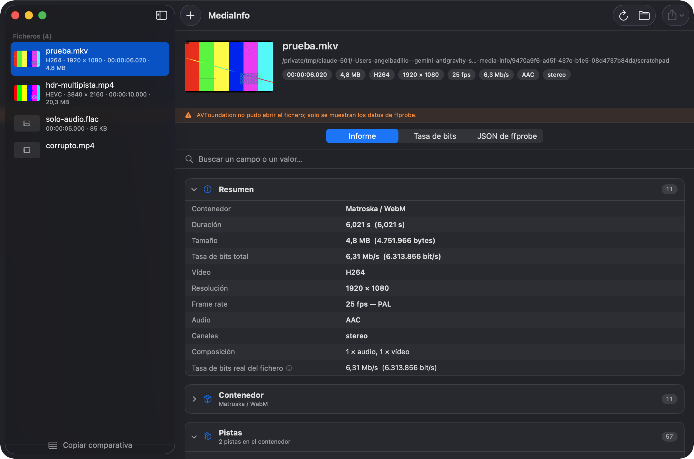
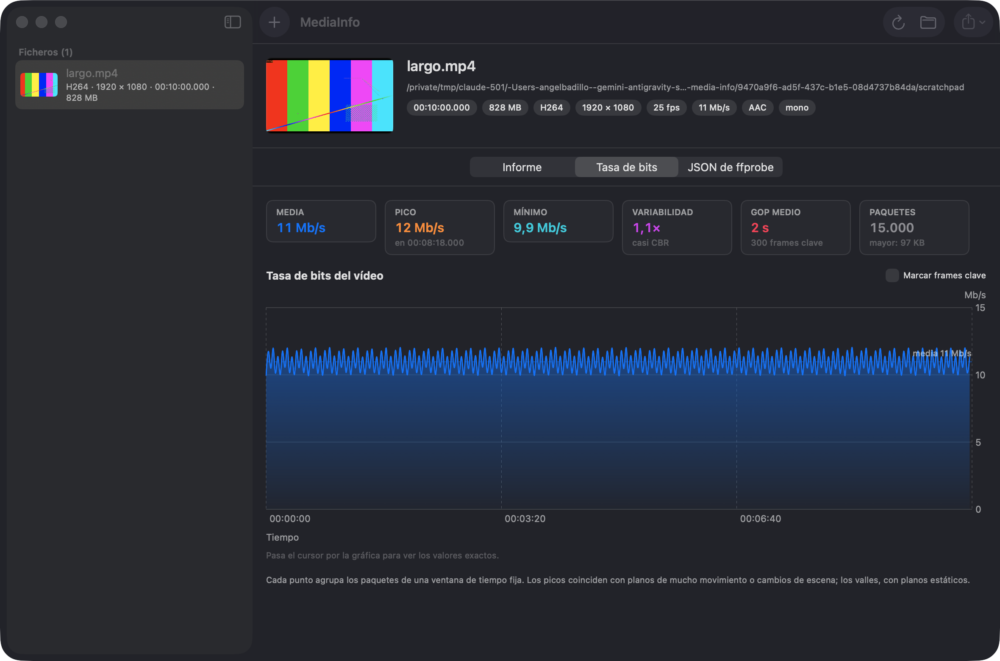

# MediaInfo

App de macOS para inspeccionar un fichero de vídeo o audio y ver **todos** sus datos
técnicos: contenedor, pistas, códecs, color, HDR, estructura de frames, tasa de bits real
medida paquete a paquete, metadatos incrustados y lo que el sistema de ficheros y Spotlight
saben del fichero.





## Qué muestra

| Sección | Contenido |
| --- | --- |
| **Resumen** | Contenedor, duración, tamaño, códecs, resolución, cadencia y tasa total. |
| **Contenedor** | Formato, fiabilidad de la detección, desplazamiento inicial, número de pistas. |
| **HDR** | Curva (PQ/HLG), gamut, profundidad, primarios y punto blanco del monitor de masterizado, MaxCLL/MaxFALL, Dolby Vision, HDR10+. |
| **Pistas** | Una ficha por pista con todos los campos que expone ffprobe, más valores derivados: relación de aspecto, megapíxeles, bits por píxel, ratio de compresión, nivel interpretado, formato de píxel explicado. |
| **Análisis de frames** | Reparto de frames I/P/B, entrelazado, pulldown, recorte del contenedor, tamaños de frame. |
| **Tasa de bits en el tiempo** | Media, pico, mínimo, variabilidad, GOP medio, gráfica interactiva. |
| **Capítulos, programas, side data** | Todo lo que traiga el contenedor. |
| **Metadatos incrustados** | Etiquetas iTunes, QuickTime, ID3, Matroska. |
| **Contenedor y pistas según macOS** | Lectura de AVFoundation, incluyendo el volcado íntegro de las extensiones de `CMFormatDescription` (SPS/PPS, atoms, tags de color). |
| **Fichero, atributos extendidos, Spotlight** | Tamaño real y en disco, fechas, UTI, cuarentena, origen de la descarga, índice de Spotlight. |

Ningún campo se descarta: las claves que ffprobe añada en versiones futuras aparecen igual,
con su nombre original. El buscador filtra por etiqueta, valor o clave original.

## Compilar

```bash
./build.sh --run
```

Produce `dist/MediaInfo.app` (~41 MB) con `ffprobe`, `ffmpeg` y sus bibliotecas incrustados,
de modo que la app funciona en cualquier Mac con Apple Silicon aunque no tenga Homebrew. El
script reescribe las rutas de carga de cada biblioteca a rutas relativas al bundle y vuelve a
firmar los binarios, que es lo que exige Apple Silicon.

Opciones:

| Opción | Efecto |
| --- | --- |
| `--run` | Lanza la app al terminar. |
| `--debug` | Compila en modo debug (más rápido al iterar). |
| `--no-ffprobe` | No incrusta los binarios; la app usará los del sistema si los encuentra. |

Requisitos para compilar: Xcode 15 o superior y `brew install ffmpeg`.
La app resultante requiere macOS 14.

## Modo de línea de comandos

El mismo binario analiza sin abrir ventana:

```bash
dist/MediaInfo.app/Contents/MacOS/MediaInfo --print vídeo.mp4
```

```bash
dist/MediaInfo.app/Contents/MacOS/MediaInfo --print vídeo.mkv --formato markdown
```

Formatos: `texto` (por omisión), `markdown`, `json`, `json-ffprobe`, `csv`.
Con `--sin-bitrate` se omite el recorrido de paquetes, que es la parte lenta.

## Cómo obtiene los datos

Tres fuentes que se complementan:

1. **ffprobe** — contenedor, pistas, side data, capítulos, programas. Se ejecuta cuatro
   veces: información general en JSON, los primeros 120 frames decodificados (los metadatos
   HDR10 viajan como SEI y sólo aparecen ahí), los paquetes del flujo principal en CSV, y la
   versión de la propia biblioteca.
2. **AVFoundation / CoreMedia** — lo que sólo expone Apple: extensiones de la descripción de
   formato, metadatos iTunes/QuickTime, características de accesibilidad, matriz de
   transformación, y la miniatura. Cuando AVFoundation no sabe abrir el contenedor (MKV,
   WebM, TS), la miniatura la extrae `ffmpeg`, que comparte las bibliotecas ya empaquetadas
   y sólo añade 0,4 MB.
3. **Sistema de ficheros y Spotlight** — tamaño lógico frente a ocupado, fechas, UTI,
   atributos extendidos (cuarentena, origen de la descarga) e índice de Spotlight.

El análisis va en dos fases: la rápida deja el informe completo en pantalla de inmediato, y
el recorrido de paquetes —que lee el fichero entero— añade después la gráfica de tasa de
bits. Se puede desactivar en Ajustes.

### Sobre la ventana de medición

Los frames clave son mucho más grandes que los demás. Si la ventana de agregación no es un
múltiplo del GOP, unos intervalos contienen frame clave y otros no, y la gráfica dibuja un
diente de sierra que no dice nada del contenido. Cuando el GOP y la ventana son de tamaño
comparable, la ventana se ajusta a un múltiplo entero del GOP. Si el GOP es mucho más largo,
se deja la ventana fina: ahí cada pico *es* un frame clave, y eso sí es información útil.

## Licencia

Este repositorio contiene sólo código propio: no incluye FFmpeg ni sus binarios, que
`build.sh` toma de la instalación local de Homebrew al empaquetar. Publicarlo no distribuye
FFmpeg, así que la GPL no le afecta.

Otra cosa es el `.app` ya construido: el `ffprobe`/`ffmpeg` de Homebrew viene compilado con
`--enable-gpl` (incluye x264 y x265), de modo que **el bundle queda cubierto por la GPL v3**.
Para uso personal no hay nada que hacer. Si algún día se lo pasas a alguien, o cumples la
licencia (ofrecer el código correspondiente) o lo compilas con `--no-ffprobe` o contra un
FFmpeg LGPL.

La firma es *ad hoc*: suficiente para ejecutar en tu Mac. Distribuir a otros equipos
requiere Developer ID y notarización.
